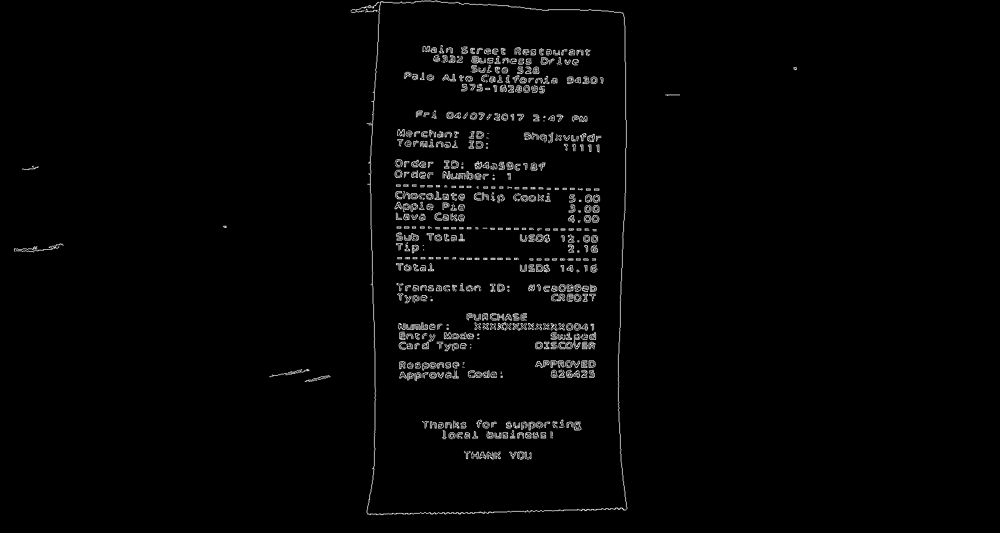
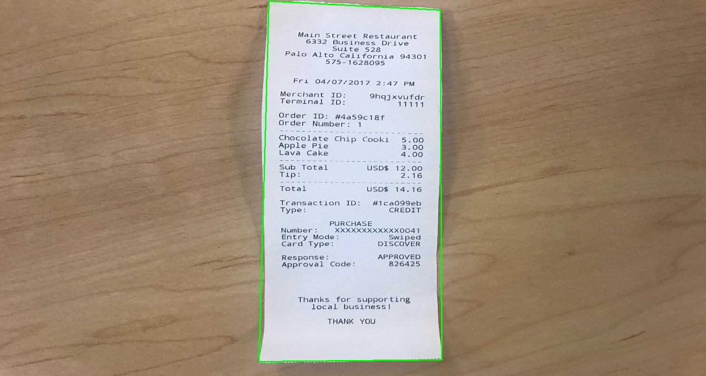
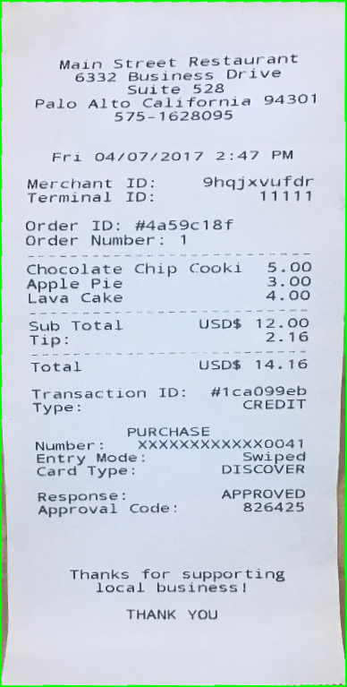
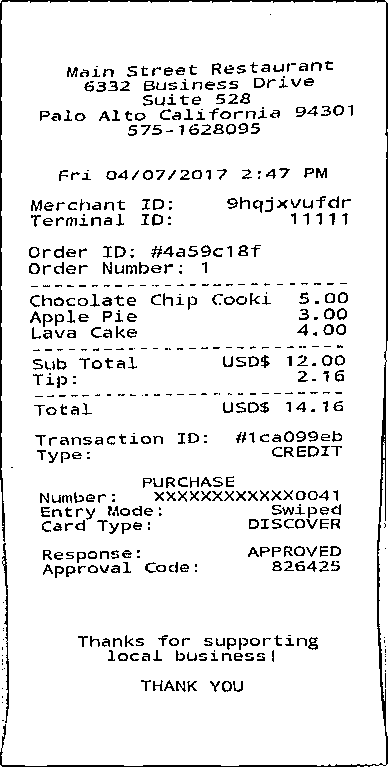

# Document-Scanner

An OpenCV and Python based document scanner.

## Usage
`python scan.py -i <path-to-image>`
The scanned image will be displayed and saved in `./images` folder.

## Example
#### Original Image

#### Edged Image using Gaussian Blur and Canny Edge Detection

#### Outlined Image

#### Perspective Transformation

#### Scanned Image

#### Refrences
[pyimagesearch](https://www.pyimagesearch.com/2014/09/01/build-kick-ass-mobile-document-scanner-just-5-minutes/)
